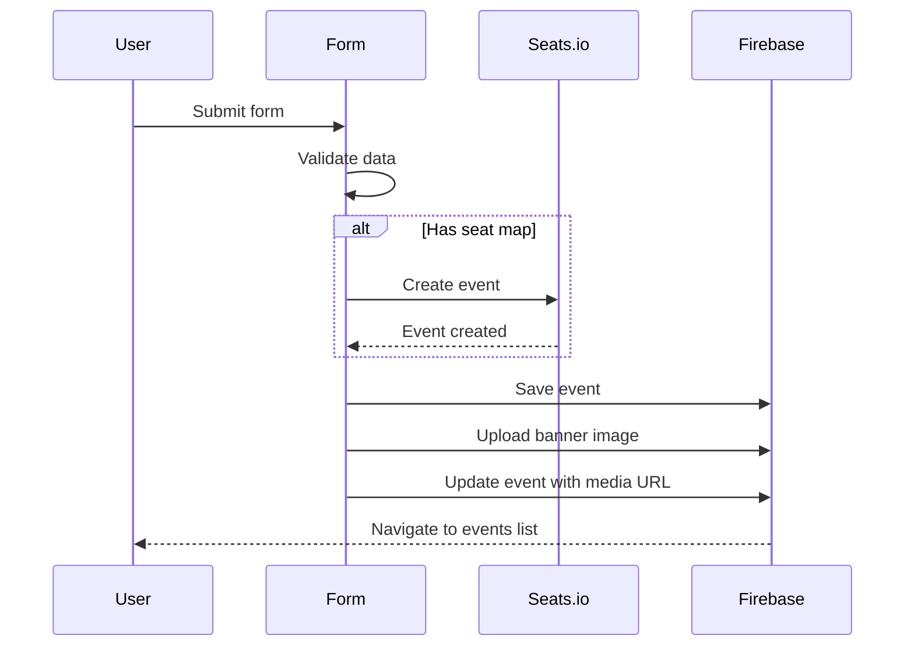

## Overview

Event components handle the creation, editing, and display of events in the TradeMaster Transactions platform. These components are located in `src/components/apps/events/`.

## EventsTable

Displays a paginated, sortable table of all events with filtering and search capabilities.

**Location:** `src/components/apps/events/EventsTable.js:27`

### Props

<ParamField path="eventID" type="string" optional>
  Optional event ID to filter the events table. If provided, only events matching this ID will be displayed.
</ParamField>

### Features

- **Search & Filter** - Global search across event name, date, status, and venue
- **Sortable Columns** - Click column headers to sort
- **Pagination** - 10, 15, or 20 rows per page
- **CSV Export** - Download event data as CSV
- **Status Badges** - Color-coded status indicators (Instanciado, Activo, Finalizado, En Progreso)
- **Permission-based Actions** - Create button only shown to users with `create:events` permission

### Usage Example

```jsx
import EventsTable from 'src/components/apps/events/EventsTable';

function EventsPage() {
  return <EventsTable />;
}
```

### Data Fields

The table displays the following columns:

| Column | Field | Description |
|--------|-------|-------------|
| Nombre | `event.name` | Event name with thumbnail |
| Fecha de Inicio | `date_start` | Event start date |
| Estatus | `status` | Event status with color badge |
| Última Acción | `ledger[last].action` | Last ledger entry with timestamp |
| Lugar del Evento | `venue_name` | Event venue name |
| Acciones | - | View details and billing buttons |

### Status Values

<ResponseField name="Instanciado" type="string">
  Event created but not yet active (yellow badge)
</ResponseField>

<ResponseField name="Activo" type="string">
  Event is currently active (green badge)
</ResponseField>

<ResponseField name="Finalizado" type="string">
  Event has ended (gray badge)
</ResponseField>

<ResponseField name="En Progreso" type="string">
  Event is in progress (blue badge)
</ResponseField>

## NewEventForm

Form component for creating new events with venue, client, and contract selection.

**Location:** `src/components/apps/events/NewEventForm.js:28`

### Features

- **Multi-step Form** - Organized sections for event data
- **Client & Contract Integration** - Select clients and link contracts
- **Venue Selection** - Choose event venues with seat map support
- **Seats.io Integration** - Preview and configure seating charts
- **Image Upload** - Upload event banner (max 2MB, 2500x900px recommended)
- **Date/Time Pickers** - Select event start and end dates
- **Form Validation** - Yup schema validation

### Form Sections

#### 1. Datos (Basic Data)

<ParamField path="client" type="object" required>
  Client object with `id` and `name` properties
</ParamField>

<ParamField path="contracts" type="array" required>
  Array of contract IDs associated with the event (minimum 1)
</ParamField>

<ParamField path="contract_legal" type="object" required>
  Legal contract object with `id` and document data
</ParamField>

<ParamField path="event_venue" type="object" required>
  Event venue object containing:
  - `id` - Venue ID
  - `name` - Venue name
  - `max` - Maximum capacity
  - `seatmap` - Optional seat map configuration
</ParamField>

#### 2. Banner del Evento

Image upload section with preview and validation:

- Accepted formats: JPG, GIF, PNG
- Maximum file size: 2MB
- Recommended dimensions: 2500x900 pixels

#### 3. Datos del Evento (Event Details)

<ParamField path="name" type="string" required>
  Event name
</ParamField>

<ParamField path="type" type="string" required>
  Event type (from setup configuration)
</ParamField>

<ParamField path="date_start" type="Date" required>
  Event start date and time
</ParamField>

<ParamField path="date_end" type="Date" required>
  Event end date and time (must be after start date)
</ParamField>

<ParamField path="description" type="string" required>
  Event description
</ParamField>

#### 4. Información del evento (Event Information)

<ParamField path="main_activity" type="string" required>
  Main activity or headline act
</ParamField>

<ParamField path="secondary_activity" type="string" required>
  Secondary activity or supporting act
</ParamField>

<ParamField path="terms_and_conditions" type="string" required>
  Event terms and conditions text
</ParamField>

<ParamField path="type_metadata_description" type="string" required>
  Detailed event/artist description
</ParamField>

### Usage Example

```jsx
import NewEventForm from 'src/components/apps/events/NewEventForm';

function CreateEventPage() {
  return (
    <div>
      <Typography variant="h4">Create New Event</Typography>
      <NewEventForm />
    </div>
  );
}
```

### Seats.io Integration

When a venue with a configured seat map is selected, the form:

1. Loads available charts from Seats.io
2. Displays a preview of the seating chart
3. Validates the chart status (must be PUBLISHED or NOT_USED)
4. Creates the event in Seats.io before saving to Firebase

Valid chart statuses for event creation:
- `NOT_USED` - Published chart with no events
- `PUBLISHED` - Published chart
- `PUBLISHED_WITH_DRAFT` - Published with draft changes

### Event Creation Flow



## EditEventForm

Form component for editing existing events.

**Location:** `src/components/apps/events/EditEventForm.js`

### Props

<ParamField path="eventId" type="string" required>
  ID of the event to edit
</ParamField>

### Features

- Pre-populated form fields with existing event data
- Similar validation to NewEventForm
- Update banner image or keep existing
- Modify event dates, venue, and details
- Update ledger with "Actualizado" action

## ClientEventsTable

Filtered events table showing only events for a specific client.

**Location:** `src/components/apps/events/ClientEventsTable.js`

### Props

<ParamField path="clientId" type="string" required>
  Client ID to filter events
</ParamField>

### Features

- Displays only events where `client_id` matches the provided ID
- Same table features as EventsTable (search, sort, pagination)
- Optimized for client detail pages

## Event Detail Components

Located in `src/components/apps/events/event-detail/`:

### EventDetailTabs

Tabbed interface for event details with sections:
- **Overview** - Event information and statistics
- **Tickets** - Ticket management and sales
- **Credentials** - Access credentials and QR codes
- **Setup** - Event configuration
- **Billing** - Financial information

### EventStatusCard

Displays current event status with options to:
- Activate event
- Finalize event
- View event progress
- Access ledger history

## Ticket Components

Located in `src/components/apps/events/Tickets/`:

### TicketTypesList

Manage ticket types for an event with pricing and inventory.

### TicketSalesTable

View ticket sales with customer information and payment status.

### TicketZoneConfig

Configure ticket zones and seating areas for the event.

## Related Components

<CardGroup cols={2}>
  <Card title="User Components" icon="users" href="/api/components/users">
    Client management components used in event forms
  </Card>
  <Card title="Venue Components" icon="building" href="/api/components/offices">
    Venue selection and management
  </Card>
  <Card title="Events Store" icon="database" href="/api/store/events">
    Redux store for events state management
  </Card>
  <Card title="Event Guides" icon="book" href="/guides/events/creating-events">
    Step-by-step guides for event operations
  </Card>
</CardGroup>
