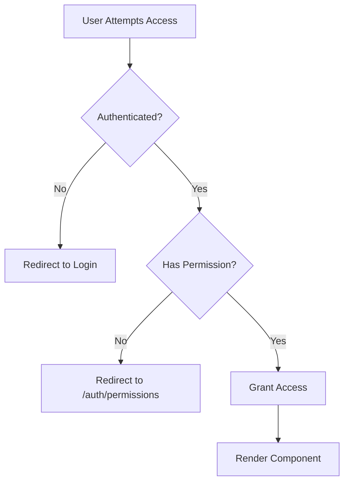

## Overview

TradeMaster Transactions implements a comprehensive security system with three layers of protection:

1. **Authentication Guards** - Verify user is logged in
2. **Guest Guards** - Restrict access to unauthenticated users only
3. **Permission Guards** - Role-based access control (RBAC)

The permission system uses **CASL (Isomorphic Authorization)** for defining and checking user abilities.

## Authentication Guard

The `AuthGuard` component protects routes that require authentication.

### Implementation

```jsx src/guards/authGuard/AuthGuard.js
import { useNavigate } from 'react-router-dom';
import useAuth from './UseAuth';
import { useEffect } from 'react';

const AuthGuard = ({ children }) => {
  const { isAuthenticated } = useAuth();
  const navigate = useNavigate();

  useEffect(() => {
    if (!isAuthenticated) {
      navigate('/auth/login', { replace: true });
    }
  }, [isAuthenticated, navigate]);

  return children;
};

export default AuthGuard;
```

### Usage

```jsx Router Configuration
{
  path: '/',
  element: (
    <AuthGuard>
      <FullLayout />
    </AuthGuard>
  ),
  children: [
    // All child routes are protected
    { path: '/dashboards/modern', element: <ModernDash /> },
    { path: '/usuarios-staff', element: <StaffTable /> },
  ],
}
```

<Note>
The AuthGuard uses `replace: true` to prevent users from using the back button to return to protected pages.
</Note>

## Guest Guard

The `GuestGuard` component restricts routes to unauthenticated users only (login, register, etc.).

### Implementation

```jsx src/guards/authGuard/GuestGuard.js
import { useNavigate } from 'react-router-dom';
import useAuth from './UseAuth';
import { useEffect } from 'react';

const GuestGuard = ({ children }) => {
  const { isAuthenticated } = useAuth();
  const navigate = useNavigate();

  useEffect(() => {
    if (isAuthenticated) {
      navigate('/', { replace: true });
    }
  }, [isAuthenticated, navigate]);

  return children;
};

export default GuestGuard;
```

### Usage

```jsx Authentication Routes
{
  path: '/auth',
  element: (
    <GuestGuard>
      <BlankLayout />
    </GuestGuard>
  ),
  children: [
    { path: '/auth/login', element: <Login /> },
    { path: '/auth/register', element: <Register /> },
    { path: '/auth/forgot-password', element: <ForgotPassword /> },
  ],
}
```

## Permission Guard

The `PermissionGuard` component implements role-based access control using CASL abilities.

### Implementation

```jsx src/guards/authGuard/PermissionGuard.js
import React from "react";
import { useNavigate } from 'react-router-dom';
import { AbilityContext } from "../contexts/AbilityContext";

const PermissionGuard = ({ children, action, subject }) => {
  const ability = React.useContext(AbilityContext);
  const navigate = useNavigate();

  React.useEffect(() => {
    if (!ability.can(action, subject)) {
      navigate("/auth/permissions", { replace: true })
    }
  }, [navigate])

  return children
};

export default PermissionGuard;
```

### Usage in Routes

```jsx Protected Routes
{
  path: '/usuarios-staff',
  element: (
    <PermissionGuard action="view" subject="ViewStaff">
      <StaffTable />
    </PermissionGuard>
  ),
},
{
  path: '/usuarios-staff-crear',
  element: (
    <PermissionGuard action="view" subject="ViewStaffCreate">
      <NewUsersStaff />
    </PermissionGuard>
  ),
}
```

### Usage in Components

Check permissions within components:

```jsx Component Permission Check
import { Can } from '@casl/react';
import { AbilityContext } from 'src/guards/contexts/AbilityContext';

function StaffActions({ staff }) {
  return (
    <AbilityContext.Consumer>
      {(ability) => (
        <div>
          {ability.can('view', 'ViewStaffEdit') && (
            <Button onClick={() => handleEdit(staff)}>Edit</Button>
          )}
          {ability.can('view', 'ViewStaffCreate') && (
            <Button onClick={handleCreate}>Create New</Button>
          )}
        </div>
      )}
    </AbilityContext.Consumer>
  );
}
```

## Ability System

The permission system is powered by CASL, which defines what actions users can perform.

### AbilityContext

```jsx src/guards/contexts/AbilityContext.js
import { createContext } from 'react';
import { Ability } from '@casl/ability';

export const AbilityContext = createContext(new Ability());
```

### Defining Abilities

Abilities are defined based on user account type in `src/guards/contexts/DefineAbilities.js`:

```jsx src/guards/contexts/DefineAbilities.js
import { AbilityBuilder, Ability } from '@casl/ability';

export function defineAbilitiesFor(user) {
  const { can, cannot, build } = new AbilityBuilder(Ability);

  if (!user) {
    return build();
  };

  if (user.account_type === 'Administrador') {
    // Admin has all permissions
    can('manage', 'all');
  } else if (user.account_type === 'Coordinador') {
    // Coordinador permissions
    can('view', 'ViewStaff');
    can('view', 'ViewClients');
    can('create', 'usersClients');
    can('edit', 'usersClients');
    // ...
    cannot('view', 'ViewStaffCreate');
    cannot('view', 'ViewStaffEdit');
  } else if (user.account_type === 'Contador') {
    // Contador permissions
    can('view', 'ViewClients');
    can('view', 'ViewContracts');
    // ...
    cannot('create', 'events');
    cannot('edit', 'events');
  }
  // ... more account types

  return build();
};
```

### Ability Provider

Abilities are provided to the app in `src/App.jsx`:

```jsx src/App.jsx
import { AbilityContext } from './guards/contexts/AbilityContext';
import { defineAbilitiesFor } from './guards/contexts/DefineAbilities';
import useAuth from 'src/guards/authGuard/UseAuth';

function App() {
  const { user } = useAuth();
  const ability = defineAbilitiesFor(user);

  React.useEffect(() => {
    // Update abilities when user changes
    ability.update(defineAbilitiesFor(user).rules);
  }, [user])

  return (
    <ThemeProvider theme={theme}>
      <AbilityContext.Provider value={ability}>
        {/* App content */}
      </AbilityContext.Provider>
    </ThemeProvider>
  );
}
```

## User Roles

The platform supports five user roles with different permission levels:

<CardGroup cols={2}>
  <Card title="Administrador" icon="crown">
    Full access to all features and settings
  </Card>
  <Card title="Coordinador" icon="users">
    Manage clients, collaborators, events, and contracts
  </Card>
  <Card title="Contador" icon="calculator">
    View financial data, contracts, and reports
  </Card>
  <Card title="Soporte" icon="headset">
    Support functions, limited event management
  </Card>
  <Card title="Creador de Sala" icon="building">
    Manage event venues only
  </Card>
</CardGroup>

### Role Permissions

<Tabs>
  <Tab title="Administrador">
    **Full Access**
    
    ```js
    can('manage', 'all');
    ```
    
    Administrators have unrestricted access to all platform features.
  </Tab>
  
  <Tab title="Coordinador">
    **Can:**
    - Create/edit clients and collaborators
    - Create/edit events and venues
    - View staff (but not create/edit)
    - Manage contracts and addendums
    - Configure event zones and splits
    - View tickets and search
    - Manage offices
    
    **Cannot:**
    - Create/edit staff
    - Change event/ticket status
    - View payouts
    - View sales details
    - Access marketing campaigns
  </Tab>
  
  <Tab title="Contador">
    **Can:**
    - View clients and contracts
    - View events and details
    - View financial reports
    - Search tickets
    
    **Cannot:**
    - Create/edit users
    - Create/edit events
    - Manage event configuration
    - View credentials
    - Change statuses
    - View payouts or campaigns
  </Tab>
  
  <Tab title="Soporte">
    **Can:**
    - View clients and collaborators
    - View event venues and details
    - View event configuration
    - View credential details
    - View ticket details
    - Search tickets
    
    **Cannot:**
    - Create/edit users
    - Create/edit events
    - Create credentials
    - View contracts
    - Change statuses
    - View financial data
  </Tab>
  
  <Tab title="Creador de Sala">
    **Can:**
    - Create/edit event venues
    - View venue details
    - View venue events
    
    **Cannot:**
    - Access any other features
  </Tab>
</Tabs>

## Permission Subjects

Permission subjects follow a naming convention based on the resource and action:

### View Permissions

```js View Permission Examples
'ViewStaff'                    // View staff list
'ViewStaffDetail'              // View staff details
'ViewStaffCreate'              // Access staff creation
'ViewStaffEdit'                // Access staff editing
'ViewClients'                  // View clients list
'ViewClientsDetail'            // View client details
'ViewEvents'                   // View events list
'ViewEventsCreate'             // Access event creation
'ViewEventsConfig'             // Access event configuration
'ViewTickets'                  // View tickets
'ViewPayouts'                  // View payouts
```

### Action Permissions

```js Action Permission Examples
['create', 'usersStaff']       // Create staff
['edit', 'usersStaff']         // Edit staff
['create', 'events']           // Create events
['edit', 'events']             // Edit events
['change', 'eventsStatus']     // Change event status
['change', 'ticketsStatus']    // Change ticket status
```

## Authentication Context

Authentication state is managed by the `AuthProvider` using Firebase.

### Firebase Auth Provider

```jsx src/guards/firebase/FirebaseContext.js
import { createContext, useEffect } from 'react';
import { firebase, Firestore } from './Firebase';
import { useDispatch } from 'react-redux';
import { authStateChanged } from 'src/store/apps/auth/authSlice';

const AuthContext = createContext({
  platform: 'Firebase',
  signup: () => Promise.resolve(),
  signin: () => Promise.resolve(),
  logout: () => Promise.resolve(),
});

export const AuthProvider = ({ children }) => {
  const dispatch = useDispatch();

  useEffect(() => {
    const unsubscribe = firebase.auth().onAuthStateChanged(async (user) => {
      if (user) {
        // Fetch user data from Firestore
        const querySnapshot = await Firestore
          .collection('u_staff')
          .doc(user.uid)
          .get();

        if (querySnapshot.data()?.status !== true) {
          logout();
        } else {
          // Update last access and IP
          await Firestore.collection('u_staff').doc(user.uid).update({
            "date.last_access": firebase.firestore.FieldValue.serverTimestamp(),
            last_IP: data.ip
          });

          // Dispatch auth state
          dispatch(authStateChanged({
            isAuthenticated: true,
            user: {
              uid: user.uid,
              email: user.email,
              account_type: querySnapshot.data()?.account_type,
              name: querySnapshot.data()?.name,
              // ... other user data
            },
          }));
        }
      } else {
        dispatch(authStateChanged({
          isAuthenticated: false,
          user: null,
        }));
      }
    });

    return () => unsubscribe();
  }, [dispatch]);

  const signin = (email, password) =>
    firebase.auth().signInWithEmailAndPassword(email, password);

  const logout = () => firebase.auth().signOut();

  return (
    <AuthContext.Provider
      value={{
        ...auth,
        platform: 'Firebase',
        signin,
        logout,
      }}
    >
      {children}
    </AuthContext.Provider>
  );
};
```

### useAuth Hook

```jsx src/guards/authGuard/UseAuth.js
import { useContext } from 'react';
import AuthContext from '../firebase/FirebaseContext';

const useAuth = () => useContext(AuthContext);

export default useAuth;
```

### Using Authentication

```jsx Component Example
import useAuth from 'src/guards/authGuard/UseAuth';

function UserProfile() {
  const { user, logout } = useAuth();

  return (
    <div>
      <h1>Welcome, {user?.name}</h1>
      <p>Role: {user?.account_type}</p>
      <p>Email: {user?.email}</p>
      <button onClick={logout}>Logout</button>
    </div>
  );
}
```

## Checking Permissions

### In Routes

```jsx Route Protection
<PermissionGuard action="view" subject="ViewStaff">
  <StaffTable />
</PermissionGuard>
```

### In Components (Method 1: Context)

```jsx Context Consumer
import { AbilityContext } from 'src/guards/contexts/AbilityContext';

function ActionButtons() {
  return (
    <AbilityContext.Consumer>
      {(ability) => (
        <div>
          {ability.can('view', 'ViewStaffEdit') && (
            <Button>Edit</Button>
          )}
        </div>
      )}
    </AbilityContext.Consumer>
  );
}
```

### In Components (Method 2: Hook)

```jsx useContext Hook
import React from 'react';
import { AbilityContext } from 'src/guards/contexts/AbilityContext';

function ActionButtons() {
  const ability = React.useContext(AbilityContext);

  if (!ability.can('view', 'ViewStaffEdit')) {
    return null;
  }

  return <Button>Edit</Button>;
}
```

### In Components (Method 3: Can Component)

```jsx CASL Can Component
import { Can } from '@casl/react';
import { AbilityContext } from 'src/guards/contexts/AbilityContext';

function ActionButtons() {
  return (
    <Can I="view" a="ViewStaffEdit" ability={AbilityContext}>
      <Button>Edit</Button>
    </Can>
  );
}
```

## Best Practices

<AccordionGroup>
  <Accordion title="Always use guards on routes">
    Never rely solely on UI hiding. Always protect routes with guards.
  </Accordion>
  
  <Accordion title="Check permissions in components">
    Hide UI elements users don't have permission to use.
  </Accordion>
  
  <Accordion title="Use descriptive subjects">
    Name permission subjects clearly: `ViewStaffCreate` not `StaffCreate`.
  </Accordion>
  
  <Accordion title="Test permission boundaries">
    Verify that role restrictions work as expected.
  </Accordion>
  
  <Accordion title="Update abilities on user change">
    Ensure abilities are updated when user data changes.
  </Accordion>
  
  <Accordion title="Handle permission errors gracefully">
    Show informative messages when access is denied.
  </Accordion>
</AccordionGroup>

## Permission Flow



<Steps>
  <Step title="Authentication Check">
    AuthGuard verifies user is authenticated
  </Step>
  <Step title="Permission Check">
    PermissionGuard checks CASL abilities
  </Step>
  <Step title="Access Granted">
    Component is rendered for authorized user
  </Step>
  <Step title="Access Denied">
    User is redirected to appropriate error page
  </Step>
</Steps>

## Next Steps

<CardGroup cols={2}>
  <Card title="Authentication" href="/guides/authentication" icon="key">
    Learn about login and user management
  </Card>
  <Card title="Routing" href="/architecture/routing" icon="route">
    Understand route configuration
  </Card>
  <Card title="State Management" href="/architecture/state-management" icon="database">
    Explore Redux store structure
  </Card>
  <Card title="User Roles" href="/guides/user-roles" icon="users">
    Detailed guide on user roles
  </Card>
</CardGroup>