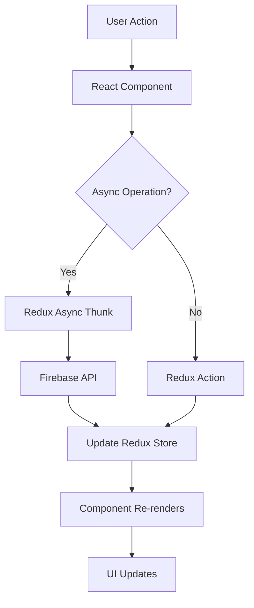

## Introduction

TradeMaster Transactions (TMT) is a modern event ticketing and transaction management platform built with React and Firebase. The application follows a component-based architecture with centralized state management, role-based access control, and real-time data synchronization.

## Tech Stack

The platform is built on a modern JavaScript stack optimized for performance and developer experience.

### Core Technologies

<CardGroup cols={2}>
  <Card title="React 18.3" icon="react">
    Component-based UI library with concurrent features
  </Card>
  <Card title="Vite 4.5" icon="bolt">
    Next-generation build tool for faster development
  </Card>
  <Card title="Redux Toolkit 1.8" icon="layer-group">
    State management with Redux best practices
  </Card>
  <Card title="Firebase 9.5" icon="fire">
    Authentication, Firestore database, and real-time sync
  </Card>
</CardGroup>

### UI Framework

```json package.json
{
  "@mui/material": "5.10.16",
  "@mui/icons-material": "5.8.4",
  "@mui/lab": "5.0.0-alpha.110",
  "@mui/x-date-pickers": "7.17.0",
  "primereact": "^10.8.2"
}
```

The platform uses **Material-UI (MUI)** as the primary component library with PrimeReact for specialized components like data tables.

### Routing & Navigation

- **React Router 6.3**: Declarative routing with nested layouts
- **Code Splitting**: Lazy loading with React.lazy() and Suspense
- **Protected Routes**: Authentication and permission guards

### State Management

- **Redux Toolkit**: Simplified Redux with createSlice
- **Redux Persist**: State persistence to localStorage
- **Firebase Integration**: Real-time data synchronization

## Application Structure

The application follows a clear separation of concerns with modular organization.

### Entry Point

The application bootstraps in `src/main.jsx` with the following provider hierarchy:

```jsx src/main.jsx
ReactDOM.createRoot(document.getElementById("root")).render(
  <Provider store={store}>
    <Suspense fallback={<Spinner />}>
      <PersistGate loading={null} persistor={persistor}>
        <BrowserRouter>
          <ToastContainer />
          <AuthProvider>
            <App />
          </AuthProvider>
        </BrowserRouter>
      </PersistGate>
    </Suspense>
  </Provider>
);
```

<Steps>
  <Step title="Redux Provider">
    Wraps the entire app to provide Redux store access
  </Step>
  <Step title="Suspense Boundary">
    Handles lazy-loaded component loading states
  </Step>
  <Step title="PersistGate">
    Delays rendering until persisted state is rehydrated
  </Step>
  <Step title="BrowserRouter">
    Enables client-side routing
  </Step>
  <Step title="AuthProvider">
    Manages Firebase authentication state
  </Step>
</Steps>

### Main App Component

The `App.jsx` component orchestrates routing, theming, and permissions:

```jsx src/App.jsx
function App() {
  const { user } = useAuth();
  const ability = defineAbilitiesFor(user)
  const routing = useRoutes(Router);
  const theme = ThemeSettings();
  const customizer = useSelector((state) => state.customizer);

  React.useEffect(() => {
    ability.update(defineAbilitiesFor(user).rules);
  }, [user])

  return (
    <ThemeProvider theme={theme}>
      <AbilityContext.Provider value={ability}>
        <RTL direction={customizer.activeDir}>
          <CssBaseline />
          <ScrollToTop>{routing}</ScrollToTop>
        </RTL>
      </AbilityContext.Provider>
    </ThemeProvider>
  );
}
```

<Note>
The ability system is dynamically updated whenever the user object changes, ensuring permissions are always current.
</Note>

## Build Configuration

Vite is configured for optimal development experience with JSX support:

```js vite.config.js
export default defineConfig({
  resolve: {
    alias: {
      src: resolve(__dirname, 'src'),
    },
  },
  esbuild: {
    loader: 'jsx',
    include: /src\/.*\.jsx?$/,
  },
  optimizeDeps: {
    esbuildOptions: {
      loader: {
        '.js': 'jsx',
      },
    },
  },
  plugins: [svgr(), react()],
});
```

### Key Features

- **Path Aliases**: `src/` imports for cleaner import paths
- **JSX in .js Files**: Treats .js files as JSX for flexibility
- **SVG as React Components**: SVGR plugin for importing SVGs
- **Fast Refresh**: HMR for instant updates during development

## Core Architectural Patterns

### 1. Feature-Based Organization

```
src/
├── guards/          # Authentication & authorization
├── layouts/         # Page layouts (full, blank)
├── routes/          # Route configuration
├── store/           # Redux slices by feature
├── views/           # Page components
├── components/      # Shared components
└── utils/           # Utilities & helpers
```

### 2. Lazy Loading

All route components are lazy-loaded to optimize initial bundle size:

```jsx
const ModernDash = Loadable(
  lazy(() => import('../views/dashboard/Modern'))
);
```

### 3. Provider Pattern

Context providers manage cross-cutting concerns:
- `AuthProvider`: Firebase authentication
- `AbilityContext.Provider`: CASL permissions
- `ThemeProvider`: MUI theming
- `Provider`: Redux store

### 4. Guard-Based Protection

Routes are protected at multiple levels:
- `AuthGuard`: Requires authentication
- `GuestGuard`: Only for unauthenticated users
- `PermissionGuard`: Requires specific permissions

## Data Flow



<Steps>
  <Step title="User Interaction">
    User interacts with UI component
  </Step>
  <Step title="Action Dispatch">
    Component dispatches Redux action or thunk
  </Step>
  <Step title="API Communication">
    For async operations, thunks call Firebase APIs
  </Step>
  <Step title="Store Update">
    Redux store is updated with new data
  </Step>
  <Step title="UI Update">
    Components re-render with updated state
  </Step>
</Steps>

## Performance Optimizations

### Code Splitting

- Route-based splitting with React.lazy()
- Separate chunks for each major feature
- Loadable wrapper for consistent loading states

### State Persistence

Critical state is persisted to localStorage:

```js src/store/Store.js
const persistConfig = {
  key: 'root',
  storage,
  whitelist: ['auth', 'customizer', 'setup']
};
```

### Bundle Optimization

- Tree shaking via ES modules
- Vite's automatic code splitting
- Dynamic imports for large dependencies

## Key Libraries

<CardGroup cols={2}>
  <Card title="@casl/ability" icon="shield">
    Role-based access control (RBAC) system
  </Card>
  <Card title="formik + yup" icon="check-square">
    Form management and validation
  </Card>
  <Card title="react-toastify" icon="bell">
    Toast notifications for user feedback
  </Card>
  <Card title="moment" icon="clock">
    Date/time manipulation and formatting
  </Card>
  <Card title="axios" icon="arrow-right-arrow-left">
    HTTP client for API requests
  </Card>
  <Card title="apexcharts" icon="chart-line">
    Interactive charts and visualizations
  </Card>
</CardGroup>

## Next Steps

<CardGroup cols={2}>
  <Card title="State Management" href="/architecture/state-management" icon="database">
    Learn about Redux store structure and slices
  </Card>
  <Card title="Routing" href="/architecture/routing" icon="route">
    Explore route configuration and navigation
  </Card>
  <Card title="Guards" href="/architecture/guards" icon="lock">
    Understand authentication and permission guards
  </Card>
  <Card title="Components" href="/components/overview" icon="cube">
    Browse available UI components
  </Card>
</CardGroup>