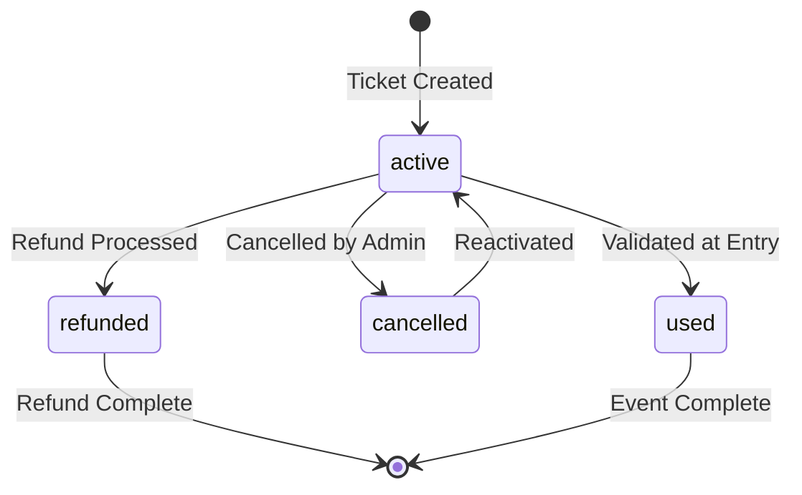

The TMT ticketing system provides comprehensive ticket management from generation through validation, including QR code generation, customer tracking, and real-time status updates.

## Ticket Lifecycle

<Steps>
  <Step title="Ticket Generation">
    Tickets are generated when event zones are configured and seating is assigned
  </Step>
  <Step title="Ticket Assignment">
    Tickets are assigned to customers during the purchase process
  </Step>
  <Step title="QR Code Generation">
    Each ticket receives a unique encrypted QR code for validation
  </Step>
  <Step title="Ticket Distribution">
    Tickets are delivered to customers via email with QR codes
  </Step>
  <Step title="Ticket Validation">
    QR codes are scanned at venue entry to validate tickets
  </Step>
  <Step title="Ticket Status Update">
    Ticket status is updated to 'used' after validation
  </Step>
</Steps>

## Ticket Structure

Tickets are stored as sub-collections under events: `events/{event_id}/tickets/{ticket_id}`

```javascript
{
  // Ticket identification
  ticket_id: string,
  ticket_number: string,
  qr_code_data: string (encrypted),
  
  // Event association
  event_id: string,
  event_name: string,
  event_date: timestamp,
  
  // Seating information
  zone: string,
  section: string,
  row: string,
  seat_number: string,
  seatsio_object_id: string,
  
  // Customer information
  customer_id: string,
  customer_name: string,
  customer_email: string,
  customer_phone: string,
  
  // Order association
  order_id: string,
  
  // Pricing
  price: number,
  service_fee: number,
  total_price: number,
  
  // Status
  status: string, // 'active', 'used', 'cancelled', 'refunded'
  
  // Timestamps
  date: {
    created: timestamp,
    purchased: timestamp,
    used: timestamp,
    updated: timestamp
  },
  
  // Ledger (history)
  ledger: [{
    action: string,
    timestamp: timestamp,
    user_id: string,
    note: string
  }]
}
```

## Ticket List View

**Location**: `src/views/Tickets/TicketTable.js`

The ticket table displays all tickets for a specific event:

```javascript
// From src/views/Tickets/TicketTable.js:15-27
React.useEffect(() => {
  const fetchData = async () => {
    const doc = await Firestore.collection(`events`).doc(id).get();
    
    if (doc.exists) {
      const data = doc.data();
      setEventData(data);
    }
  };
  
  fetchData();
}, [])
```

The view includes:
- Event banner with event information (`ProfileBanner` component)
- Ticket list with filters and search (`TicketTableList` component)
- Pagination and sorting
- Quick actions (view details, change status)

**Implementation**: `src/components/apps/events/Tickets/TicketList/TicketView.js`

## Ticket Search

**Location**: `src/views/Tickets/TicketSearch.js`

Search for tickets across all events:

**Search Capabilities:**
- Search by ticket number
- Search by customer name
- Search by customer email
- Search by order ID
- Search by QR code
- Filter by event
- Filter by status
- Filter by date range

**Implementation**: `src/components/apps/events/Tickets/SearchTicket/TicketSearchForm.js`

## Ticket Details

**Location**: `src/views/Tickets/DisplayTicket.js`

View comprehensive ticket information:

### Customer Information Section

```javascript
// From src/components/apps/events/Tickets/DisplayTicket/DisplayTicket.js:56-61
const hasCustomerData = Boolean(
  ticket?.customer_name || 
  ticket?.customer_id || 
  ticket?.customer_email || 
  ticket?.customer_phone
);
```

Displays:
- Customer name (with icon)
- Customer ID
- Email address
- Phone number

Only shown if customer data exists on the ticket.

### Ticket Information

Displayed fields from `src/components/apps/events/Tickets/DisplayTicket/DisplayTicket.js`:

- Ticket number
- Event name and date
- Zone/Section/Row/Seat
- Price breakdown (ticket price + service fee)
- Current status
- QR code for validation

### QR Code Generation

```javascript
// From src/components/apps/events/Tickets/DisplayTicket/DisplayTicket.js:42-48
const secPin = await helpers_event_pin({ event_id: eventID });
const data = ticketQuery.data();
const dataString = `${eventID}-${id}`;
const encrypted = encrypt(dataString, secPin.data?.qr_pin);
setTicketQR(encrypted);
```

<Note>
  QR codes are encrypted using the event's unique security PIN. The encryption combines the event ID and ticket ID, then encrypts with the event's `qr_pin`.
</Note>

QR code display:

```jsx
<QRCode 
  value={ticketQR}
  size={256}
  level="H"
  includeMargin={true}
/>
```

### Status Management

**Component**: `src/components/apps/events/Tickets/DisplayTicket/StatusSelect.js`

```javascript
// Ticket statuses
const statuses = [
  { value: 'active', label: 'Active', color: 'success' },
  { value: 'used', label: 'Used', color: 'default' },
  { value: 'cancelled', label: 'Cancelled', color: 'error' },
  { value: 'refunded', label: 'Refunded', color: 'warning' }
];
```

<Warning>
  Changing ticket status requires the `change:ticketsStatus` permission. Only Administrador role has this permission.
</Warning>

### Ticket Ledger (History)

**Component**: `src/components/apps/events/Tickets/DisplayTicket/Ledger.js`

The ledger tracks all actions performed on a ticket:

```javascript
{
  action: string, // 'created', 'purchased', 'used', 'cancelled', 'refunded', 'status_changed'
  timestamp: timestamp,
  user_id: string,
  user_name: string,
  note: string,
  previous_status: string,
  new_status: string
}
```

**Ledger Display**: `src/components/apps/events/Tickets/DisplayTicket/LedgerDate.js`

Shows chronological history with:
- Action type with icon
- Timestamp (formatted)
- User who performed action
- Additional notes

## Ticket Query System

**Location**: `src/views/Tickets/TicketQuery.js`

Alternative ticket lookup system for quick queries:

- Query by QR code scan
- Query by ticket number
- Fast validation for entry gates
- Simplified display for quick checks

**Display Component**: `src/components/apps/events/Tickets/DisplayTicket/DisplayQueryTicket.js`

## Credentials System

Credentials are special access tickets for staff, VIP, or backstage access.

### Creating Credentials

**Location**: See [Event Management - Event Credentials](/features/event-management#event-credentials)

Credentials are stored in: `events/{event_id}/credentials/{credential_id}`

```javascript
// From src/components/apps/events/credentials-events/new-credentials-events/NewCredentialsEventsForm.js:55-68
const credentialData = {
  access: values.access, // 'backstage', 'vip', 'staff', 'press', 'vendor'
  date: {
    created: firebase.firestore.FieldValue.serverTimestamp(),
    updated: ''
  },
  description: values.description,
  holder: {
    id: values.holder_id,
    name: values.holder_name
  },
  name: values.name,
  status: true,
};
```

### Credential Types

<CardGroup cols={2}>
  <Card title="Staff" icon="user-tie">
    Access for event staff and workers
  </Card>
  <Card title="VIP" icon="star">
    Premium access for VIP guests
  </Card>
  <Card title="Backstage" icon="door-open">
    Backstage and restricted area access
  </Card>
  <Card title="Press" icon="camera">
    Media and press credentials
  </Card>
  <Card title="Vendor" icon="store">
    Vendor and supplier access
  </Card>
  <Card title="Artist" icon="microphone">
    Performer and artist access
  </Card>
</CardGroup>

## Ticket Permissions

Ticket management requires permissions from `src/guards/contexts/DefineAbilities.js`:

```javascript
// Creating tickets (automatic during event setup)
can('create', 'eventsTickets') // Coordinador

// Reading tickets
can('read', 'eventsTickets') // Coordinador
can('view', 'ViewTickets') // Limited roles
can('view', 'ViewTicketsDetail') // Coordinador, Soporte

// Ticket search
can('view', 'TicketSearchView') // Coordinador, Contador, Soporte
can('view', 'QueryTicketDisplay') // Coordinador, Contador, Soporte

// Changing ticket status
can('change', 'ticketsStatus') // Administrador only
```

## Customer Tickets View

**Location**: `src/views/Users/Customers/customers-detail/CustomerTickets.js`

View all tickets owned by a specific customer:

- Ticket list grouped by event
- Status indicators
- Quick access to ticket details
- Download/print options

**Implementation**: `src/components/apps/users/Customers/TicketView.js`

## Ticket Generation Process

Tickets are generated during event setup:

<Steps>
  <Step title="Zone Configuration">
    Event zones are configured with pricing
  </Step>
  <Step title="Seating Import">
    Seats are imported from Seats.io chart
  </Step>
  <Step title="Ticket Creation">
    A ticket document is created for each seat/standing position
  </Step>
  <Step title="QR Code Preparation">
    QR code data is prepared (generated on-demand when purchased)
  </Step>
</Steps>

## Ticket Purchase Flow

When a customer purchases tickets:

1. **Seat Selection**: Customer selects seats from Seats.io interactive chart
2. **Order Creation**: Order document created with selected tickets
3. **Ticket Assignment**: Tickets assigned to customer with their information
4. **QR Generation**: Unique encrypted QR code generated for each ticket
5. **Payment Processing**: Payment is processed
6. **Ticket Delivery**: Tickets sent via email with QR codes
7. **Ledger Update**: Purchase action logged in ticket ledger

## Ticket Validation

At venue entry:

1. **QR Code Scan**: Entry staff scans ticket QR code
2. **Decryption**: QR data is decrypted using event PIN
3. **Ticket Lookup**: System retrieves ticket by event ID and ticket ID
4. **Status Check**: Verifies ticket status is 'active'
5. **Validation**: Confirms customer information matches
6. **Status Update**: Updates ticket status to 'used'
7. **Ledger Entry**: Logs validation action with timestamp

## Ticket Status Workflow



## Ticket Pricing

Ticket pricing structure:

```javascript
{
  base_price: number,        // Zone/seat base price
  service_fee: number,       // Platform service fee
  processing_fee: number,    // Payment processing fee
  taxes: number,             // Applicable taxes
  total_price: number        // Total customer pays
}
```

## Bulk Ticket Operations

<Accordion title="Bulk Status Changes">
  Update multiple ticket statuses simultaneously:
  - Cancel multiple tickets (refunds, event cancellation)
  - Activate multiple tickets (restore cancelled tickets)
  - Mark multiple as used (group entry)
</Accordion>

<Accordion title="Bulk Export">
  Export ticket data:
  - CSV export for reporting
  - PDF export for printing
  - Customer list export
  - Sales report export
</Accordion>

## Best Practices

<Check>
  **Ticketing Best Practices:**
  - Generate unique QR codes for each ticket
  - Always log status changes in ledger
  - Validate ticket status before allowing entry
  - Keep customer information secure and encrypted
  - Test QR code scanning before event day
  - Provide clear ticket delivery confirmation
  - Monitor ticket status in real-time during events
  - Maintain ticket history for dispute resolution
  - Use proper permissions for sensitive operations
  - Regular backup of ticket data
</Check>

## Ticket Security

<Warning>
  **Security Considerations:**
  - QR codes use event-specific encryption keys
  - Encryption keys are stored securely in Firebase
  - Each event has a unique `qr_pin` for ticket encryption
  - QR codes cannot be duplicated without the encryption key
  - Ticket status is checked in real-time to prevent reuse
  - Ledger provides audit trail for all ticket operations
</Warning>

## Troubleshooting

<Accordion title="QR Code Won't Scan">
  **Problem**: QR code fails to scan at entry
  
  **Solutions**:
  - Ensure adequate lighting for scanner
  - Increase QR code size on screen/print
  - Clean camera lens on scanning device
  - Verify QR code is not damaged or corrupted
  - Use manual ticket lookup by ticket number
  - Check network connectivity for validation
</Accordion>

<Accordion title="Ticket Shows as Used">
  **Problem**: Customer ticket shows as already used
  
  **Solutions**:
  - Check ledger for validation history
  - Verify customer identity
  - Look for duplicate ticket issues
  - Check if ticket was refunded/cancelled
  - Contact customer about ticket transfer
  - Admin can reactivate if legitimate
</Accordion>

<Accordion title="Customer Information Missing">
  **Problem**: Ticket has no customer information
  
  **Solutions**:
  - Check if ticket was purchased as guest
  - Verify order association
  - Check customer document in u_customers collection
  - Update ticket with customer info if available
  - Review purchase flow for data capture issues
</Accordion>

## Related Features

- [Event Management](/features/event-management) - Creating events that generate tickets
- [Venue Management](/features/venue-management) - Seating charts and capacity
- [Financial Operations](/features/financial-operations) - Ticket sales and revenue
- [User Management](/features/user-management) - Customer data and profiles
