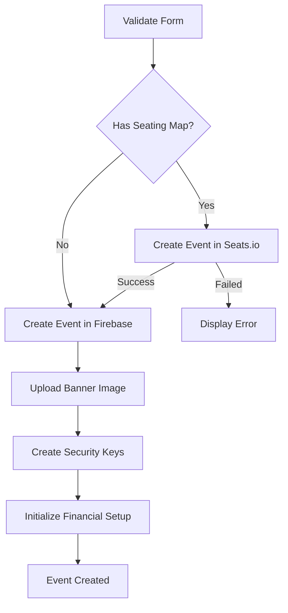

# Creating Events

Learn how to create new events in the TMT platform, from basic information to venue configuration and seating map integration.

## Overview

The event creation process involves setting up client relationships, configuring venue details, and optionally integrating with Seats.io for advanced seating management. Events are the foundation of ticket sales and operations in TMT.

<Warning>
Once an event is created with a seating map from Seats.io, the client and venue selection cannot be modified. Plan carefully before creating the event.
</Warning>

## Prerequisites

Before creating an event, ensure you have:

- Active client account with valid contracts
- Legal contract configuration for financial setup
- Event venue configured in the system
- Event banner image (recommended: 2500x900 pixels, max 2MB)

## Creating a New Event

<Steps>

### Step 1: Navigate to Events

From the main dashboard, navigate to **Events** → **New Event**.

### Step 2: Configure Client Relationship

Select the client and contract information:

```jsx
<Grid container spacing={3}>
  <Grid item xs={12} sm={6}>
    <CustomFormLabel htmlFor="Client">Cliente</CustomFormLabel>
    <CustomSelect
      fullWidth
      id="client"
      variant="outlined"
      onChange={(e) => searchContracts(e.target.value.id)}
    >
      {/* Client options */}
    </CustomSelect>
  </Grid>
  
  <Grid item xs={12} sm={6}>
    <CustomFormLabel htmlFor="contracts">Contratos</CustomFormLabel>
    <Autocomplete
      multiple
      id="contracts"
      options={contracts}
      disableCloseOnSelect
    />
  </Grid>
</Grid>
```

**Required Fields:**
- **Cliente** - The client organization hosting the event
- **Contratos** - One or more active contracts (at least one required)
- **Contrato Legal** - Legal contract for financial configuration

### Step 3: Select Event Venue

Choose the venue where the event will take place:

```jsx
<CustomSelect
  fullWidth
  id="event_venue"
  value={formik.values.event_venue}
  onChange={async (e) => {
    setFieldValue('event_venue', e.target.value);
    const selectedVenue = eventsVenues.find(v => v.value.id === e.target.value.id);
    
    // If venue has seating map, load and validate
    if (selectedVenue?.fullData?.seatmap?.chartKey) {
      await loadSeatsioCharts(selectedVenue.fullData.seatmap.chartKey);
    }
  }}
>
  {eventsVenues.map((option) => (
    <MenuItem key={option.name} value={option.value}>
      {option.name}
      {option.value.seatmap?.chartKey && ' 🗺️'}
    </MenuItem>
  ))}
</CustomSelect>
```

Venues with a 🗺️ icon have integrated seating maps from Seats.io.

### Step 4: Upload Event Banner

Provide a banner image for the event:

- **Supported formats:** JPG, GIF, PNG
- **Maximum size:** 2MB
- **Recommended dimensions:** 2500x900 pixels

```jsx
<Button variant="contained" color="primary" component="label">
  Cargar
  <input 
    hidden 
    accept="image/jpeg, image/png, image/gif" 
    type="file" 
    onChange={handleImageChange} 
  />
</Button>
```

<Warning>
The banner image is required. The system will prevent event creation without a valid banner image.
</Warning>

### Step 5: Configure Event Details

Provide core event information:

**Basic Information:**
- **Nombre** - Event name (displayed to customers)
- **Tipo de Evento** - Event type (Concierto, Conferencia, etc.)
- **Fecha de Inicio** - Event start date and time
- **Fecha de Cierre** - Event end date and time
- **Descripción** - Detailed event description

**Event Metadata:**
- **Actividad Principal** - Main activity or artist name
- **Actividad Secundaria** - Secondary activity or supporting act
- **Términos y Condiciones** - Event-specific terms and conditions
- **Descripción del Artista** - Artist or performer description

```jsx
<Grid container spacing={3}>
  <Grid item xs={12} sm={6}>
    <CustomTextField
      id="name"
      variant="outlined"
      fullWidth
      {...getFieldProps('name')}
    />
  </Grid>
  
  <Grid item xs={12} sm={6}>
    <CustomDateTimePicker
      value={dayjs(eventStartDate)}
      minDate={dayjs(new Date())}
      onChange={(newDate) => setEventStartDate(newDate.$d)}
      fullWidth
    />
  </Grid>
</Grid>
```

### Step 6: Review Seating Map (if applicable)

If the selected venue has a seating map, review the chart status:

- **NOT_USED** ✅ - Published map without events, ready for use
- **PUBLISHED** ✅ - Published and ready for events
- **PUBLISHED_WITH_DRAFT** ✅ - Has draft changes but can create events
- **DRAFT** ⚠️ - Not published, cannot create events

The system automatically validates the chart status and displays appropriate messages.

### Step 7: Submit Event Creation

Click **Guardar** to create the event. The system will:

1. **Validate all required fields**
2. **Create event in Seats.io** (if seating map is configured)
3. **Generate event ID** in Firebase
4. **Upload banner image** to storage
5. **Create security credentials** (QR/PIN system)
6. **Initialize financial setup** from legal contract

</Steps>

## Event Creation Process Flow

The platform follows this sequence when creating an event:



## Seating Map Integration

When a venue with a Seats.io map is selected, the event is automatically linked:

```javascript
// Event data stored includes complete Seats.io information
EventData.seatsio_event = {
  eventId: eventData?.id,
  eventKey: eventData?.key,
  chartKey: selectedChartStatus.key,
  chartName: selectedChartStatus.name,
  createdAt: new Date().toISOString(),
  status: 'CREATED',
  categories: eventData?.categories || [],
  eventDate: eventData?.date,
  thumbnailUrl: selectedChartStatus?.publishedVersionThumbnailUrl,
  rawData: seatsioEventData
}
```

This integration enables:
- Real-time seat selection during ticket purchase
- Visual seating charts for customers
- Automated seat reservation and hold management
- Zone-based pricing from Seats.io categories

## Validation Requirements

The event form validates the following:

| Field | Validation Rule |
|-------|----------------|
| name | Required |
| description | Required |
| main_activity | Required |
| secondary_activity | Required |
| terms_and_conditions | Required |
| type_metadata_description | Required |
| type | Required, from predefined list |
| client | Required object with id and name |
| contract_legal | Required object |
| event_venue | Required object |
| contracts | Required array, minimum 1 item |
| banner image | Required, max 2MB |

## Event Status

Newly created events have the status **"Instanciado"** (Instantiated). The event lifecycle includes:

1. **Instanciado** - Event created, setup required
2. **En Configuración** - Event setup in progress
3. **Activo** - Event published and accepting sales
4. **Finalizado** - Event completed

See [Event Setup](/guides/events/event-setup) for next steps after event creation.

## Common Issues

### Seating Map Validation Errors

If you receive an error about seating map validation:

<Warning>
"No se pudo crear el evento porque el mapa de asientos tiene validaciones pendientes."
</Warning>

This means the Seats.io chart is not fully configured. To resolve:

1. Log into your Seats.io account
2. Review the chart for validation errors
3. Ensure all seating sections are properly defined
4. Publish the chart in Seats.io
5. Retry event creation in TMT

### Client Not Found

If the client dropdown is empty:

1. Navigate to **Clients** → **Client Management**
2. Verify the client exists and is active
3. Check that the client has at least one active contract
4. Refresh the event creation page

### Venue Without Seating Map

Events can be created without seating maps. These events:
- Use manual zone configuration
- Require zone setup in the next phase
- Don't support real-time seat selection
- Are suitable for general admission events

See [Event Setup](/guides/events/event-setup) for configuring zones manually.

## Next Steps

After creating an event:

<CardGroup cols={2}>
  <Card title="Event Setup" icon="gear" href="/guides/events/event-setup">
    Configure event zones, seating, and pricing
  </Card>
  <Card title="Credentials" icon="id-badge" href="/guides/events/credentials">
    Manage event access credentials
  </Card>
</CardGroup>

## Related Resources

- [Event Setup Guide](/guides/events/event-setup)
- [Venue Management](/features/venue-management)
- [Client Management](/guides/users/managing-clients)
- [Event Management Features](/features/event-management)
