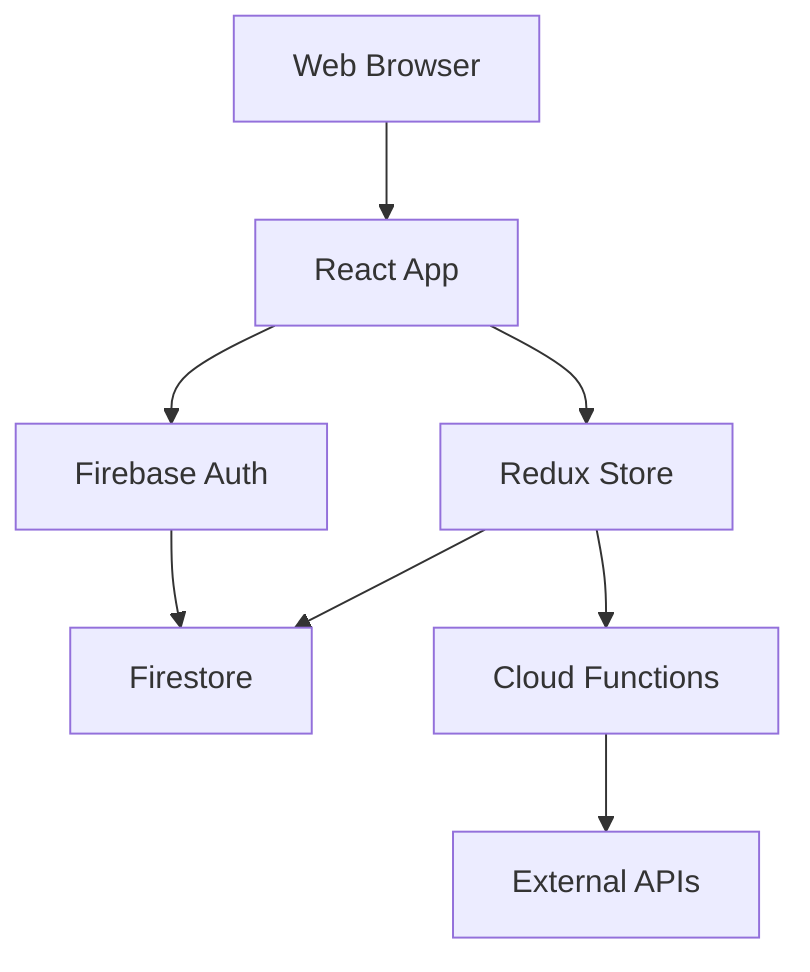

# Introduction to TradeMaster Transactions

TradeMaster Transactions (TMT) is a powerful React-based SaaS platform designed for managing events, tickets, transactions, and financial operations. Built with modern web technologies, TMT provides a comprehensive solution for event organizers, offices, and administrators to streamline their operations.


## What is TMT?

TMT is an enterprise-grade administration panel that enables organizations to:

- **Manage Events & Venues**: Create and manage events, event venues, and seating charts with Seats.io integration
- **Handle Tickets**: Generate, track, and validate tickets with QR codes and real-time status updates
- **Process Transactions**: Track all financial transactions, conciliations, and payments across multiple offices
- **Oversee Users**: Manage staff, collaborators, clients, and customers with role-based permissions
- **Financial Operations**: Handle contracts, payouts, custody accounts, and billing operations
- **Office Management**: Coordinate multiple offices with portal assignments and transaction tracking

## Key Features

<CardGroup cols={2}>
  <Card title="Event Management" icon="calendar">
    Create and manage events with complete control over venues, tickets, pricing, and seating arrangements
  </Card>
  <Card title="Transaction Processing" icon="credit-card">
    Process and reconcile transactions across multiple payment methods and offices
  </Card>
  <Card title="Role-Based Access" icon="shield">
    Secure access control using CASL abilities with granular permissions for staff, clients, and collaborators
  </Card>
  <Card title="Real-Time Updates" icon="bolt">
    Firebase-powered real-time data synchronization across all connected clients
  </Card>
</CardGroup>

## Core Modules

### Events & Tickets
Manage the complete lifecycle of events from creation to ticket sales, validation, and reporting. Features include:
- Event creation with venue assignment
- Ticket generation and QR code creation
- Real-time ticket status tracking
- Offline ticket management for offices

### Financial Management
Comprehensive financial operations including:
- Transaction tracking and conciliation
- Bank and company document management
- Payout processing and distribution
- Contract and addendum management
- Custody accounts and billing

### User Management
Multi-tiered user system supporting:
- **Staff**: Internal administrators with full access
- **Clients**: Event organizers and owners
- **Collaborators**: Event helpers and support staff
- **Customers**: End users purchasing tickets

### Office Network
Manage distributed sales offices with:
- Portal assignments and access control
- Office-specific transaction tracking
- Offline ticket allocation and sales
- Performance analytics by office

## Technology Stack

TMT is built with a modern, scalable technology stack:

<CodeGroup>
```json package.json
{
  "dependencies": {
    "react": "^18.3.1",
    "@mui/material": "5.10.16",
    "@reduxjs/toolkit": "1.8.3",
    "react-router-dom": "6.3.0",
    "firebase": "^9.5.0",
    "@auth0/auth0-spa-js": "^2.1.3",
    "axios": "0.27.2",
    "formik": "2.2.9",
    "yup": "^0.32.11"
  }
}
```
</CodeGroup>

### Frontend
- **React 18**: Modern UI with hooks and concurrent features
- **Material-UI v5**: Comprehensive component library with custom theming
- **Redux Toolkit**: State management with Redux Persist for offline support
- **React Router v6**: Client-side routing with protected routes
- **Vite**: Lightning-fast build tool and development server

### Backend Services
- **Firebase Auth**: User authentication and authorization
- **Cloud Firestore**: Real-time NoSQL database
- **Cloud Functions**: Serverless backend operations
- **Firebase Storage**: File and document storage

### Additional Libraries
- **Formik + Yup**: Form management and validation
- **ApexCharts**: Data visualization and analytics
- **Leaflet**: Interactive maps for venue locations
- **Seats.io**: Seating chart management
- **React QR Code**: Ticket QR code generation

## Platform Architecture



The platform follows a modern single-page application (SPA) architecture:

1. **Presentation Layer**: React components styled with Material-UI
2. **State Management**: Redux Toolkit with persistent storage
3. **Authentication**: Firebase Authentication with custom user validation
4. **Data Layer**: Cloud Firestore for real-time data synchronization
5. **Business Logic**: Firebase Cloud Functions for server-side operations

## Who Should Use TMT?

TMT is designed for:

- **Event Organizers**: Managing multiple events with complex ticketing needs
- **Venue Operators**: Controlling venue assignments and capacity
- **Financial Administrators**: Overseeing transactions, conciliations, and payouts
- **Office Managers**: Running distributed sales operations
- **System Administrators**: Managing users, permissions, and platform configuration

## Next Steps

<CardGroup cols={2}>
  <Card title="Quick Start" icon="rocket" href="/quickstart">
    Get up and running with TMT in minutes
  </Card>
  <Card title="Installation" icon="download" href="/installation">
    Set up your development environment
  </Card>
</CardGroup>

<Note>
  TMT requires Firebase configuration and proper authentication setup. Make sure you have the necessary credentials before starting.
</Note>
